# 🚀 Mojila Work Portfolio

  <h2>💼 Professional Developer & Tech Enthusiast</h2>
  

    <a href="https://linkedin.com/in/mojila">🔗 LinkedIn</a> • 
    <a href="mailto:me.mojila@gmail.com">📧 me.mojila@gmail.com</a>
  

---

## 🎯 Featured Projects

  <table>
    <tr>
      <td align="center" width="33%">
        

           
           <h3><a href="https://github.com/mojila/linimasa-ai" target="_blank" style="color: white; text-decoration: none;">🤖 Linimasa.AI</a></h3>
          
<strong>Status:</strong> Ongoing

           
<strong>Role:</strong> Full-stack

          
<strong>Tech Stack:</strong>

          
🦀 Rust • ⚛️ React.js • 🧠 Ollama LLM • 🔧 Qdrant

        

      </td>
      <td align="center" width="33%">
        

           
           <h3><a href="https://dealls.com" target="_blank" style="color: white; text-decoration: none;">💼 Deals Job</a></h3>
          
<strong>Status:</strong> Online

           
<strong>Role:</strong> Technical Lead - Backend

          
<strong>Tech Stack:</strong>

          
🟢 Node.js • 😠PostgreSQL • 🔧 Redis • 🯠Kafka

        

      </td>
      <td align="center" width="33%">
        

           
           <h3><a href="https://kantorku.id" target="_blank" style="color: white; text-decoration: none;">🏢 Kantorku</a></h3>
          
<strong>Status:</strong> Online

           
<strong>Role:</strong> Technical Lead - Backend

          
<strong>Tech Stack:</strong>

          
🹠Go • 😠PostgreSQL • 🔧 Redis • 🯠Kafka

        

      </td>
    </tr>
    <tr>
      <td align="center" colspan="3">
        

          <h3>🔒 Hidden</h3>
          
<strong>Status:</strong> Ongoing

           
<strong>Role:</strong> Frontend, Desktop

          
<strong>Tech Stack:</strong>

          
⚛️ React JS • 🦀 Rust

        

      </td>
    </tr>
  </table>

---

## 🛠️ Technical Skills

  <h3>🚀 Languages & Frameworks</h3>
  

    
    
    
    
  

  
  <h3>🗄️ Databases & Tools</h3>
  

    
    
    
  

  
  <h3>🤖 AI & Machine Learning</h3>
  

    
    
    
  

---

## 📊 Project Status Overview

```mermaid
graph TD
    A[🚀 Mojila Portfolio] --> B[🤖 Linimasa.AI]
    A --> C[💼 Deals Job]
    A --> D[🏢 Kantorku]
    A --> E[🔒 Hidden]
    
    B --> B1[🦀 Rust Backend]
    B --> B2[⚛️ React Frontend]
    B --> B3[🧠 AI Integration]
    
    C --> C1[🟢 Node.js API]
    C --> C2[🐘 PostgreSQL]
    C --> C3[🔧 Cache & Queue]
    
    D --> D1[🐹 Go Services]
    D --> D2[🔧 Redis Cache]
    D --> D3[🎯 Message Queue]
    
    E --> E1[⚛️ React UI]
    E --> E2[🦀 Rust Core]
    
    style A fill:#334155,stroke:#475569,stroke-width:3px
     style B fill:#64748B,stroke:#475569,stroke-width:2px
     style C fill:#0F766E,stroke:#134E4A,stroke-width:2px
     style D fill:#0F766E,stroke:#134E4A,stroke-width:2px
     style E fill:#64748B,stroke:#475569,stroke-width:2px
```

---

## 🎯 What I Do

  <table>
    <tr>
      <td align="center" width="25%">
        <h3>🚀 Full-Stack Development</h3>
        
Building end-to-end solutions with modern tech stacks

      </td>
      <td align="center" width="25%">
        <h3>🤖 AI Integration</h3>
        
Implementing LLM and vector database solutions

      </td>
      <td align="center" width="25%">
        <h3>🏗️ System Architecture</h3>
        
Designing scalable and maintainable systems

      </td>
      <td align="center" width="25%">
        <h3>📊 Performance Optimization</h3>
        
Monitoring and optimizing application performance

      </td>
    </tr>
  </table>

---

## 📈 Current Focus

- 🤖 **AI/ML Integration**: Working with Ollama LLM and vector databases
- 🦀 **Rust Development**: Building high-performance backend services
- ⚛️ **Modern Frontend**: Creating responsive and interactive user interfaces
- 🔧 **DevOps & Monitoring**: Implementing robust deployment and monitoring solutions

---

  <h2>🤝 Let's Connect!</h2>
  

    
    
  

  
  
<em>"Building the future, one line of code at a time" 🚀</em>

---

  ⭐ Star this repository if you find it interesting!

